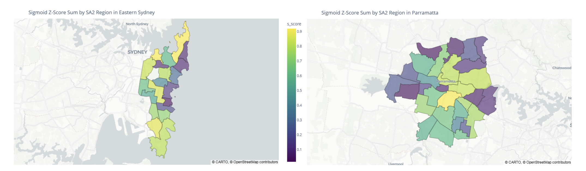

# Greater Sydney Spatial Accessibility Analysis (on Parramatta and Eastern Suburbs)

*Spatial equity score across Parramatta and Eastern Suburbs SA2 regions.*  


This project was developed as part of the **DATA2901 Assignment (Semester 1, 2025)** at the University of Sydney.  
It analyses spatial equity across Greater Sydney by integrating demographic, business, public transport, and school catchment data into a geospatial database.  

The project evaluates accessibility to infrastructure and services across Statistical Area Level 2 (SA2) regions, producing a spatial equity score to identify areas with potential infrastructure mismatches.

In addition to spatial analysis, the project incorporates a **machine learning regression model** to examine the relationship between accessibility scores and socioeconomic indicators. This model helps uncover patterns and correlations that traditional analysis might overlook, supporting data-driven decision-making for urban planning and resource allocation.


## Overview

The goal is to:
- Aggregate and join multiple open datasets at the SA2 level.
- Perform spatial joins using PostGIS to link demographic, economic, and accessibility data.
- Calculate accessibility scores based on business count, school catchments, public transport stops, and points of interest.
- Visualise spatial equity and identify priority regions for infrastructure improvement.

## Data Sources

| Dataset          | Source                                           | Description |
|------------------|--------------------------------------------------|-------------|
| **sa2_boundaries** | ABS SA2 shapefile                              | Geographic boundaries of SA2 regions in Greater Sydney. |
| **businesses**     | ABS Business Register                          | Number of businesses by SA2 and industry code. |
| **stops**          | Transport for NSW Open Data (GTFS)             | Public transport stops (buses, trains). |
| **catchments**     | NSW Department of Education                    | Catchment polygons for public schools in NSW. |
| **population**     | ABS Census 2021                                | SA2-level demographic data (total & age-grouped population). |
| **income**         | ABS Census 2021                                | Median income per SA2 region. |
| **sa2_pois**       | NSW POI API                                    | Points of interest (e.g., supermarkets, libraries). |

## Data Processing

1. **Database Setup**  
   - Created a PostgreSQL + PostGIS database.  
   - Added schema `greater_sydney` for project data.  
   - Enabled spatial support with `CREATE EXTENSION postgis`.

2. **Data Loading**  
   - Imported shapefiles, CSV, and GTFS datasets into PostGIS using `GeoPandas` and SQLAlchemy.
   - Ensured all geometry columns were transformed to a consistent SRID (EPSG:4326).

3. **Data Integration**  
   - Performed spatial joins between SA2 boundaries and:
     - Public transport stops  
     - School catchments  
     - Businesses  
     - POIs
   - Aggregated counts per SA2.

4. **Scoring**  
   - Applied z-score, sigmoid, and rank-based transformations to normalise metrics.
   - Combined scores to create an **Infrastructure Accessibility Score**.

5. **Visualisation**  
   - Mapped results using `GeoPandas` and `matplotlib` to highlight high and low accessibility areas.

## Key Findings

- **Accessibility within SA4s is polarised**, with SA2s often either *very high* or *very low* in scores.  
- **Eastern Suburbs:** *Low scores* along the coastline, except for **high-scoring** areas like *Rose Bay–Vaucluse–Watsons Bay*.  
- **Parramatta:** *Lower scores* on SA4 edges, **higher scores** in central areas.  
- **Balance matters more than spikes** – high overall scores do not require every component to be above average.  
- **Negative correlation** between accessibility score and median income (*−0.33 in Parramatta*, *−0.17 in Eastern Suburbs*).  
- **Rank-based scoring** rewards *well-rounded access*; **sigmoid** rewards *high values* in specific components.  
- **Regression model:** POIs **positively** relate to income, while *area*, *businesses per 1000*, and *stops* show **negative** relationships.  
- **Scores are relative** within each SA4 and *exclude SA2s with population <100*.  


## How to Run

### Requirements
- Python 3.12+
- PostgreSQL with PostGIS extension
- Python packages:
  ```bash
  pip install geopandas sqlalchemy psycopg2-binary geoalchemy2 matplotlib pandas
  ```

### Database Credentials
This project uses a `credentials.json` file to store PostgreSQL connection details.  
Before running the notebook:
1. Open `credentials.json`.
2. Update the `"password"` field with your **pgAdmin / PostgreSQL password**.
3. Ensure the `"user"`, `"host"`, and `"database"` fields match your local setup.

Example `credentials.json`:
```json
{
   "host": "localhost",
   "port": 5432,
   "database": "localhost",
   "user": "postgres",
   "password": "<your-password>"
 }
```

### Steps
1. Clone this repository:
   ```bash
   git clone https://github.com/devilshadow04/greater-sydney-spatial-analysis.git
   cd greater-sydney-spatial-analysis
   ```
2. Create the database and enable PostGIS:
   ```sql
   CREATE DATABASE sydney_analysis;
   \c sydney_analysis
   CREATE EXTENSION postgis;
   ```
3. Update connection settings in `credentials.json`.
4. Run the notebook cells in order to:
   - Load datasets into PostGIS.
   - Perform joins and scoring.
   - Generate visualisations.

---

**Author:** Cong Thanh Vu, Bao Ngo
